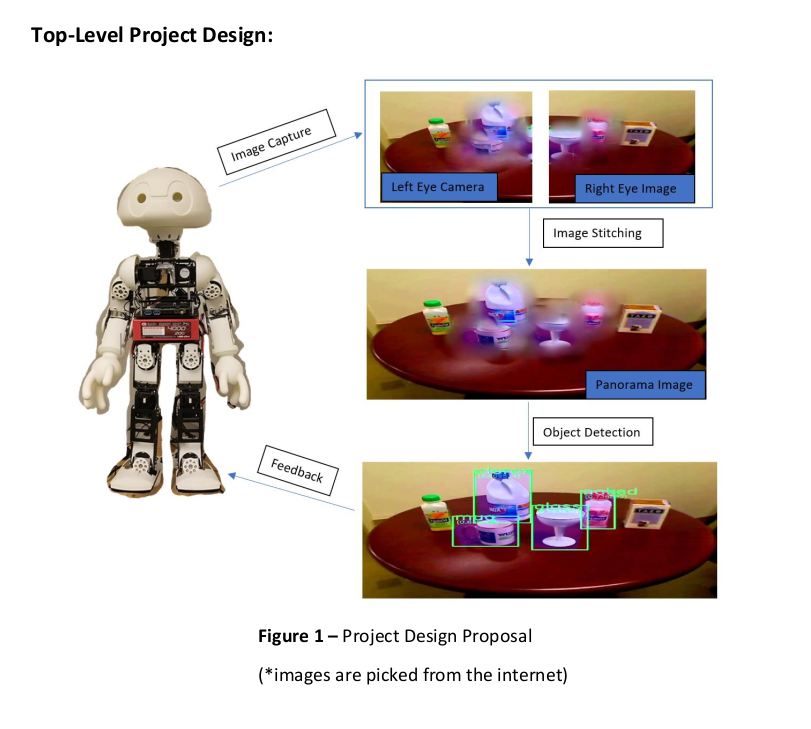

# Panorama-stitching-for-humanoid-robot-vision

CS 510 - Computational Photography Final Project Fall 2018

This projects gaol is creating panoramic images using the two cameras located in the head of the humanoid robot. The paper Recognizing Panoramas by M. Brown and D. G. Lowe is used as an example to build panoramic images. All the other resources and the methods are in the project report and presentation.

